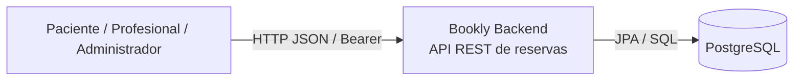
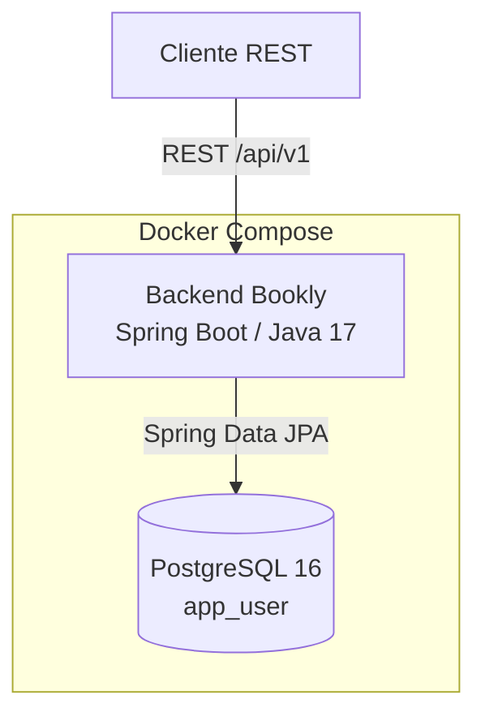
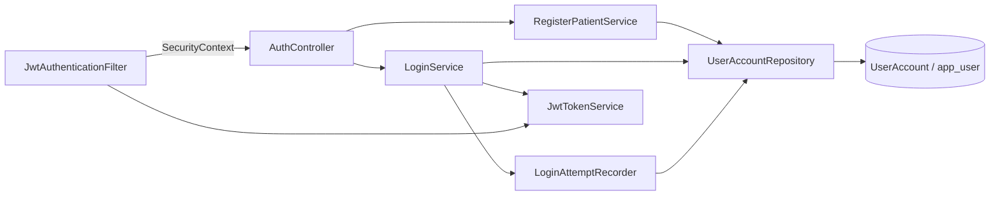
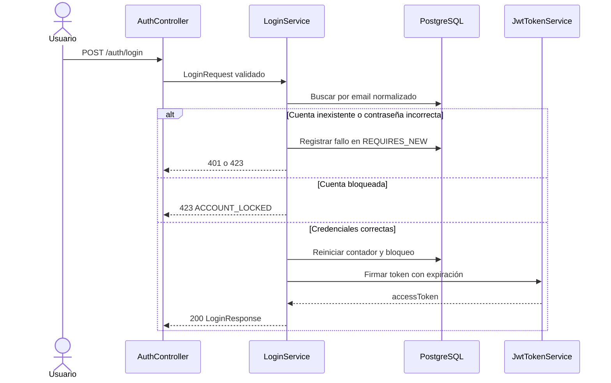

# Arquitectura de software - Sprint 1

## 1. Propósito y alcance

Este documento describe la arquitectura inicial del backend de Bookly para el Sprint 1. Su alcance incluye el proyecto base Spring Boot, HU-01 (registro de paciente), HU-03 (inicio de sesión seguro), la persistencia de usuarios y el despliegue inicial con Docker Compose.

La solución se mantiene como un monolito modular porque el alcance actual es pequeño, existe un único dominio principal y el equipo necesita reducir la complejidad operativa. La separación por módulos permite evolucionar a nuevos dominios sin iniciar prematuramente una arquitectura de microservicios.

## 2. Requisitos arquitectónicos

| Tipo | Requisito |
|---|---|
| Funcional | Registrar pacientes e iniciar sesión con credenciales |
| Seguridad | Hash de contraseñas, validación, bloqueo temporal y autenticación Bearer |
| Integridad | Correo único, campos obligatorios y roles válidos |
| Operación | Ejecutar backend y PostgreSQL mediante Docker Compose |
| Mantenibilidad | Separar presentación, aplicación, dominio e infraestructura |
| Interoperabilidad | API REST versionada y JSON |

## 3. Vista de contexto C4



El cliente HTTP representa Postman durante las pruebas del Sprint 1 y posteriormente podrá ser un frontend web. El backend es responsable de validar, autenticar y aplicar reglas; PostgreSQL conserva los datos transaccionales.

## 4. Vista de contenedores C4



El contenedor backend es stateless: no mantiene sesión HTTP. El estado de cuenta, intentos fallidos y bloqueo se almacenan en PostgreSQL. El token firmado permite autenticar solicitudes posteriores.

## 5. Vista de componentes del módulo de autenticación



### Interfaces principales

| Componente | Interfaz o responsabilidad |
|---|---|
| `AuthController` | `POST /api/v1/auth/register` y `POST /api/v1/auth/login` |
| `RegisterPatientService` | Normalizar email/nombre, validar duplicados y guardar BCrypt |
| `LoginService` | Validar cuenta, contraseña, estado de bloqueo y emitir respuesta |
| `LoginAttemptRecorder` | Persistir fallos en una transacción independiente para evitar rollback del contador |
| `JwtTokenService` | Firmar y validar token HMAC-SHA256 con `sub`, `email`, `role` y `exp` |
| `JwtAuthenticationFilter` | Leer `Authorization: Bearer`, validar token y poblar `SecurityContext` |
| `UserAccountRepository` | Acceso JPA a `app_user` por UUID y email |
| `GlobalExceptionHandler` | Contrato uniforme para errores de validación, registro y autenticación |

## 6. Flujo de login



## 7. Seguridad implementada y pendientes

Implementado: BCrypt, política de contraseña, normalización de email, respuestas genéricas ante credenciales inválidas, bloqueo temporal, token firmado y expiración, API stateless, validación de payloads y secretos configurables por ambiente.

Pendiente para completar los lineamientos avanzados: MFA para administración, revocación y rotación de tokens, cookies `HttpOnly`/`Secure` si el cliente las requiere, CORS restringido, rate limiting por IP/cuenta, logs estructurados de eventos de seguridad, SCA/SAST/DAST y pruebas con base PostgreSQL real.

## 8. Decisiones arquitectónicas (ADR)

### ADR-001: Monolito modular

- **Estado:** Aceptada.
- **Contexto:** El Sprint 1 contiene autenticación y persistencia inicial.
- **Decisión:** Usar un backend Spring Boot organizado por módulos (`auth`, `shared`) y capas explícitas.
- **Alternativas:** Microservicios desde el inicio; arquitectura CRUD sin separación.
- **Consecuencias:** Menor costo de despliegue y depuración; se requiere disciplina para evitar acoplamiento entre dominios.

### ADR-002: PostgreSQL como persistencia transaccional

- **Estado:** Aceptada.
- **Contexto:** Usuarios, roles, restricciones y estado de bloqueo requieren consistencia.
- **Decisión:** PostgreSQL 16 como fuente de verdad, accedido mediante Spring Data JPA.
- **Alternativas:** Base documental; servicio administrado sin control local.
- **Consecuencias:** Integridad mediante constraints y facilidad de ejecución local; las migraciones deben versionarse y aplicarse correctamente.

### ADR-003: BCrypt y token Bearer HMAC-SHA256

- **Estado:** Aceptada para Sprint 1.
- **Contexto:** Se necesita autenticación stateless sin almacenar contraseñas en claro.
- **Decisión:** Guardar solo BCrypt y emitir tokens firmados con expiración configurable.
- **Alternativas:** Sesiones HTTP; OAuth/OIDC externo; almacenar contraseñas cifradas reversiblemente.
- **Consecuencias:** Escalamiento sencillo y menor estado en el backend; se deben agregar rotación, revocación y MFA para producción avanzada.

### ADR-004: Persistir el fallo fuera de la transacción de respuesta

- **Estado:** Aceptada.
- **Contexto:** Devolver una excepción después de incrementar el contador provocaba rollback.
- **Decisión:** `LoginAttemptRecorder` usa `REQUIRES_NEW` para confirmar el contador antes de responder `401` o `423`.
- **Consecuencias:** El bloqueo es durable; requiere revisar concurrencia y control de intentos distribuidos en una futura evolución.

## 9. Estructura del código

```text
src/main/java/com/bookly/backendcf/
├── auth/
│   ├── application/       # casos de uso y reglas de autenticación
│   ├── configuration/      # BCrypt y Spring Security
│   ├── domain/model/       # UserAccount y UserRole
│   ├── infrastructure/    # repositorios JPA
│   ├── presentation/      # controlador y DTOs REST
│   └── security/           # emisión y filtro JWT
└── shared/error/          # errores HTTP uniformes
```

## 10. Evidencia y próximos pasos

La aplicación compila, arranca con Docker Compose y la suite actual cubre contexto y los tres escenarios principales de HU-03. Para completar el Sprint 1 de arquitectura se debe anexar el contrato OpenAPI versionado, habilitar análisis estático/Quality Gate y agregar pruebas de integración contra PostgreSQL en contenedor.
