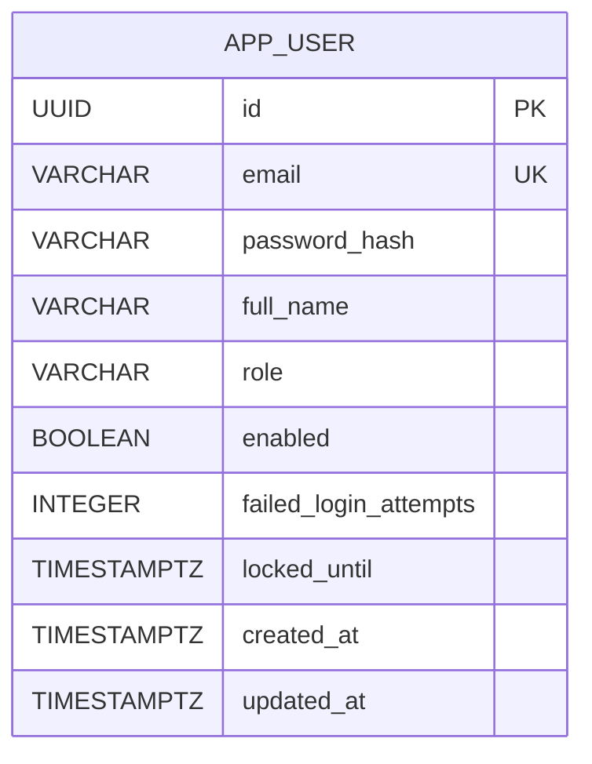

# Base de datos - Sprint 1

## 1. Propósito y alcance

Este documento presenta el diseño lógico y físico inicial de Bookly para HU-01 (registro de paciente) y HU-03 (inicio de sesión seguro). PostgreSQL es la fuente de verdad para las cuentas, roles y estado de protección contra intentos fallidos.

El modelo está preparado para extenderse en los siguientes sprints con profesionales, servicios, agendas y reservas. Esas entidades todavía no se agregan porque no existe una HU implementada que defina sus reglas y relaciones.

## 2. Entidades y relaciones

### Diagrama ER



En Sprint 1 existe una única entidad persistida: `app_user`. Por tanto, no hay relaciones FK entre entidades todavía. El diagrama muestra la clave primaria y la restricción de unicidad del correo, que es el identificador funcional usado por el login.

## 3. Reglas de negocio persistidas

| Regla | Implementación |
|---|---|
| Cada cuenta tiene un identificador | `id UUID PRIMARY KEY` |
| El correo identifica una cuenta | `email NOT NULL UNIQUE`, longitud máxima 320 |
| No se almacenan contraseñas en claro | `password_hash` recibe BCrypt desde la aplicación |
| Toda cuenta tiene rol | `role NOT NULL` y `CHECK` para `PATIENT`, `PROFESSIONAL`, `ADMIN` |
| Una cuenta nueva está habilitada | `enabled NOT NULL`, valor inicial `TRUE` |
| Los fallos son contables | `failed_login_attempts NOT NULL DEFAULT 0` |
| El bloqueo puede estar ausente | `locked_until` permite `NULL` cuando no hay bloqueo |
| Las fechas son trazables | `created_at` y `updated_at` son obligatorias |

## 4. Modelo lógico

### APP_USER

| Atributo | Tipo lógico | Nulabilidad | Clave / dominio | Descripción |
|---|---|---:|---|---|
| `id` | Identificador UUID | No | PK | Identificador interno |
| `email` | Cadena de correo | No | UK, máximo 320 | Credencial funcional normalizada a minúsculas |
| `password_hash` | Cadena hash | No | — | Resultado de BCrypt |
| `full_name` | Cadena | No | Máximo 150 | Nombre mostrado |
| `role` | Enumeración | No | PATIENT, PROFESSIONAL, ADMIN | Rol de autorización futuro |
| `enabled` | Booleano | No | — | Permite deshabilitar la cuenta |
| `failed_login_attempts` | Entero | No | >= 0 por regla de aplicación | Intentos fallidos acumulados |
| `locked_until` | Fecha-hora con zona | Sí | — | Fin del bloqueo temporal |
| `created_at` | Fecha-hora con zona | No | — | Fecha de creación |
| `updated_at` | Fecha-hora con zona | No | — | Última actualización |

El modelo se encuentra normalizado para este alcance: cada atributo es atómico, no existen grupos repetidos ni dependencias parciales, y los atributos describen únicamente a la cuenta. El diseño cumple el objetivo de 3FN para la entidad actual.

## 5. Preguntas de negocio y consultas clave

Las siguientes preguntas cubren filtros, agregaciones y consultas de estado. Las consultas son ejemplos para PostgreSQL y pueden ejecutarse sobre la tabla creada por los scripts de inicialización.

### 1. ¿Existe una cuenta con un correo determinado?

```sql
SELECT id, email, enabled
FROM app_user
WHERE email = LOWER('juan@example.com');
```

### 2. ¿Cuántas cuentas existen por rol?

```sql
SELECT role, COUNT(*) AS total
FROM app_user
GROUP BY role
ORDER BY role;
```

### 3. ¿Qué cuentas están bloqueadas actualmente?

```sql
SELECT email, failed_login_attempts, locked_until
FROM app_user
WHERE locked_until IS NOT NULL
  AND locked_until > CURRENT_TIMESTAMP
ORDER BY locked_until;
```

### 4. ¿Qué cuentas acumulan más intentos fallidos?

```sql
SELECT email, failed_login_attempts, locked_until
FROM app_user
WHERE failed_login_attempts > 0
ORDER BY failed_login_attempts DESC, email;
```

### 5. ¿Cuántas cuentas se registraron por día?

```sql
SELECT created_at::date AS registration_date, COUNT(*) AS total
FROM app_user
GROUP BY created_at::date
ORDER BY registration_date DESC;
```

### 6. ¿Qué porcentaje de cuentas está habilitado?

```sql
SELECT ROUND(100.0 * COUNT(*) FILTER (WHERE enabled) / NULLIF(COUNT(*), 0), 2)
       AS enabled_percentage
FROM app_user;
```

## 6. Modelo físico PostgreSQL

El modelo físico lo aplica **Flyway** al arrancar, desde `src/main/resources/db/migration`:

- `V1__baseline_app_user.sql`: creación inicial de `app_user`.
- `V2__add_login_security.sql`: columnas de bloqueo de cuenta y CHECK de roles (antes `002-add-login-security.sql`).
- `V3__create_organization.sql`: tabla `organization` (tenant).
- `V4__add_tenant_to_app_user.sql`: `tenant_id` en `app_user` y unicidad de correo por organización.

DDL equivalente para una base nueva:

```sql
CREATE TABLE IF NOT EXISTS app_user (
    id UUID NOT NULL,
    email VARCHAR(320) NOT NULL,
    password_hash VARCHAR(255) NOT NULL,
    full_name VARCHAR(150) NOT NULL,
    role VARCHAR(30) NOT NULL,
    enabled BOOLEAN NOT NULL,
    failed_login_attempts INTEGER NOT NULL DEFAULT 0,
    locked_until TIMESTAMPTZ,
    created_at TIMESTAMPTZ NOT NULL,
    updated_at TIMESTAMPTZ NOT NULL,
    CONSTRAINT pk_app_user PRIMARY KEY (id),
    CONSTRAINT uk_app_user_email UNIQUE (email),
    CONSTRAINT ck_app_user_role
        CHECK (role IN ('PATIENT', 'PROFESSIONAL', 'ADMIN'))
);
```

El índice único generado para `email` soporta la consulta principal de login y evita duplicados. No se agregan índices redundantes en Sprint 1. Si las consultas de cuentas bloqueadas aumentan, se puede evaluar un índice parcial:

```sql
CREATE INDEX IF NOT EXISTS idx_app_user_locked_until
    ON app_user (locked_until)
    WHERE locked_until IS NOT NULL;
```

Debe medirse su beneficio con `EXPLAIN (ANALYZE, BUFFERS)` antes de incorporarlo al script definitivo.

## 7. Integridad, seguridad y operación

- El usuario de aplicación de Compose es configurable y no debe ser el superusuario en producción.
- Las credenciales se entregan mediante variables de entorno; no se guardan en el código.
- Las consultas se realizan con Spring Data JPA; no se concatenan entradas del usuario en SQL.
- `password_hash` nunca contiene la contraseña original.
- El conteo de fallos se confirma en una transacción independiente para evitar que el error HTTP haga rollback del bloqueo.
- Las migraciones usan `IF NOT EXISTS`, pero en producción deben evolucionar hacia una herramienta de migración versionada como Flyway o Liquibase.
- La conexión de producción debe usar TLS y respaldos protegidos.
- No se registran contraseñas, hashes, tokens ni secretos en logs.

## 8. Volumen y crecimiento inicial

El volumen esperado del Sprint 1 es bajo y la tabla es pequeña. La clave UUID evita exponer una secuencia predecible y facilita futuras integraciones. El campo `email` es el principal acceso de lectura. Para sprints posteriores deberán estimarse usuarios, reservas, historial y concurrencia antes de decidir particionamiento o desnormalización.

## 9. Ejecución y verificación

Levantar la base:

```bash
docker compose up -d db
```

Verificar estructura y datos:

```bash
docker compose exec db psql -U backendcf -d backendcf -c '\d app_user'
docker compose exec db psql -U backendcf -d backendcf -c 'SELECT * FROM app_user;'
```

Si el volumen ya existía, `002-add-login-security.sql` debe aplicarse manualmente:

```bash
docker compose exec db psql -U backendcf -d backendcf \
  -f /docker-entrypoint-initdb.d/002-add-login-security.sql
```

## 10. Pendientes de evolución

Para los siguientes sprints se deberán agregar y relacionar las entidades que surjan de las HU: profesional, servicio, disponibilidad, reserva, cancelación e historial. También se deberán completar auditoría de acciones críticas, roles de base de datos con mínimo privilegio, un script físico único/versionado, pruebas de restauración y procedimientos o triggers únicamente cuando exista una regla que justifique su ejecución dentro de PostgreSQL.
