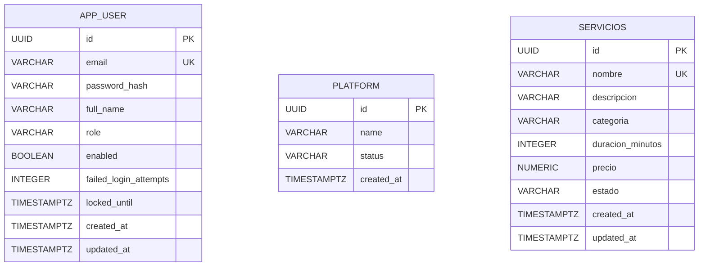

# Base de datos - Sprint 1

## 1. Propósito y alcance

Este documento presenta el diseño lógico y físico implementado de Bookly para HU-01 (registro de cliente), HU-02 (catálogo de servicios), HU-03 (inicio de sesión seguro) y HU-20 (configuración inicial de la plataforma). PostgreSQL es la fuente de verdad para las cuentas, el catálogo, la plataforma, los roles y el estado de protección contra intentos fallidos.

El modelo está preparado para extenderse en los siguientes sprints con profesionales, agendas y reservas. Las especialidades de HU-02 se representan inicialmente mediante `servicios.categoria`, de acuerdo con el [ADR-005](docs/ADR-005-alcance-HU-02.md); no existe una entidad independiente mientras no haya reglas que la justifiquen.

## 2. Entidades y relaciones

### Diagrama ER



En Sprint 1 existen las entidades persistidas `app_user`, `platform` y `servicios`. No hay relaciones FK
entre ellas todavía: la plataforma es única y el catálogo se mantiene independiente hasta que las HUs
de profesionales y reservas definan sus relaciones. `app_user.email` y `servicios.nombre` tienen
unicidad para sus respectivas reglas de negocio.

## 3. Reglas de negocio persistidas

| Regla | Implementación |
|---|---|
| Cada cuenta tiene un identificador | `id UUID PRIMARY KEY` |
| El correo identifica una cuenta | `email NOT NULL UNIQUE`, longitud máxima 320 |
| No se almacenan contraseñas en claro | `password_hash` recibe BCrypt desde la aplicación |
| Toda cuenta tiene rol | `role NOT NULL` y `CHECK` para `CUSTOMER`, `PROFESSIONAL`, `ADMIN` |
| Una cuenta nueva está habilitada | `enabled NOT NULL`, valor inicial `TRUE` |
| Los fallos son contables | `failed_login_attempts NOT NULL DEFAULT 0` |
| El bloqueo puede estar ausente | `locked_until` permite `NULL` cuando no hay bloqueo |
| Las fechas son trazables | `created_at` y `updated_at` son obligatorias |

## 4. Modelo lógico

### APP_USER

| Atributo | Tipo lógico | Nulabilidad | Clave / dominio | Descripción |
|---|---|---:|---|---|
| `id` | Identificador UUID | No | PK | Identificador interno |
| `email` | Cadena de correo | No | UK, máximo 320 | Credencial funcional normalizada a minúsculas |
| `password_hash` | Cadena hash | No | — | Resultado de BCrypt |
| `full_name` | Cadena | No | Máximo 150 | Nombre mostrado |
| `role` | Enumeración | No | CUSTOMER, PROFESSIONAL, ADMIN | Rol de autorización futuro |
| `enabled` | Booleano | No | — | Permite deshabilitar la cuenta |
| `failed_login_attempts` | Entero | No | >= 0 por regla de aplicación | Intentos fallidos acumulados |
| `locked_until` | Fecha-hora con zona | Sí | — | Fin del bloqueo temporal |
| `created_at` | Fecha-hora con zona | No | — | Fecha de creación |
| `updated_at` | Fecha-hora con zona | No | — | Última actualización |

El modelo se encuentra normalizado para este alcance: cada atributo es atómico, no existen grupos repetidos ni dependencias parciales, y los atributos describen únicamente a la cuenta. El diseño cumple el objetivo de 3FN para la entidad actual.

### PLATFORM

| Atributo | Tipo lógico | Nulabilidad | Clave / dominio | Descripción |
|---|---|---:|---|---|
| `id` | Identificador UUID | No | PK, una sola fila | Identificador de la plataforma |
| `name` | Cadena | No | Máximo 200 | Nombre de la plataforma |
| `status` | Enumeración | No | ACTIVE, SUSPENDED | Estado operativo |
| `created_at` | Fecha-hora con zona | No | — | Fecha de aprovisionamiento |

La unicidad de `platform` se garantiza mediante el índice único sobre la expresión constante `true`.

### SERVICIOS

| Atributo | Tipo lógico | Nulabilidad | Clave / dominio | Descripción |
|---|---|---:|---|---|
| `id` | Identificador UUID | No | PK | Identificador interno |
| `nombre` | Cadena | No | Único sin distinguir mayúsculas, máximo 150 | Nombre comercial del servicio |
| `descripcion` | Cadena | Sí | Máximo 500 | Descripción opcional |
| `categoria` | Cadena | No | Máximo 100 | Especialidad funcional del servicio |
| `duracion_minutos` | Entero | No | 1 a 480 | Duración usada por futuras agendas |
| `precio` | Decimal | No | Mayor que 0, máximo 2 decimales | Precio del servicio |
| `estado` | Enumeración | No | ACTIVO, INACTIVO | Disponibilidad del servicio |
| `created_at` | Fecha-hora con zona | No | — | Fecha de creación |
| `updated_at` | Fecha-hora con zona | No | — | Última actualización |

`servicios` se mantiene independiente en este sprint. La relación con profesionales y reservas se
agregará cuando las HUs correspondientes definan sus claves foráneas y reglas de negocio.

## 5. Preguntas de negocio y consultas clave

Las siguientes preguntas cubren filtros, agregaciones y consultas de estado. Las consultas son ejemplos para PostgreSQL y deben ejecutarse sobre el esquema creado por Flyway.

### 1. ¿Existe una cuenta con un correo determinado?

```sql
SELECT id, email, enabled
FROM app_user
WHERE email = LOWER('juan@example.com');
```

### 2. ¿Cuántas cuentas existen por rol?

```sql
SELECT role, COUNT(*) AS total
FROM app_user
GROUP BY role
ORDER BY role;
```

### 3. ¿Qué cuentas están bloqueadas actualmente?

```sql
SELECT email, failed_login_attempts, locked_until
FROM app_user
WHERE locked_until IS NOT NULL
  AND locked_until > CURRENT_TIMESTAMP
ORDER BY locked_until;
```

### 4. ¿Qué cuentas acumulan más intentos fallidos?

```sql
SELECT email, failed_login_attempts, locked_until
FROM app_user
WHERE failed_login_attempts > 0
ORDER BY failed_login_attempts DESC, email;
```

### 5. ¿Cuántas cuentas se registraron por día?

```sql
SELECT created_at::date AS registration_date, COUNT(*) AS total
FROM app_user
GROUP BY created_at::date
ORDER BY registration_date DESC;
```

### 6. ¿Qué porcentaje de cuentas está habilitado?

```sql
SELECT ROUND(100.0 * COUNT(*) FILTER (WHERE enabled) / NULLIF(COUNT(*), 0), 2)
       AS enabled_percentage
FROM app_user;
```

### 7. ¿Qué servicios activos existen por categoría?

```sql
SELECT categoria, COUNT(*) AS total_servicios
FROM servicios
WHERE estado = 'ACTIVO'
GROUP BY categoria
ORDER BY categoria;
```

### 8. ¿Qué servicios requieren más tiempo de atención?

```sql
SELECT nombre, categoria, duracion_minutos, precio
FROM servicios
WHERE estado = 'ACTIVO'
ORDER BY duracion_minutos DESC, nombre;
```

## 6. Modelo físico PostgreSQL

El modelo físico lo aplica **Flyway** al arrancar, desde `src/main/resources/db/migration`:

- `V1__baseline_app_user.sql`: creación inicial de `app_user`.
- `V2__add_login_security.sql`: columnas de bloqueo de cuenta y CHECK de roles (antes `002-add-login-security.sql`).
- `V3__create_platform.sql`: tabla `platform`, limitada a una sola fila.
- `V4__rename_patient_role_to_customer.sql`: migra el rol histórico `PATIENT` a `CUSTOMER` y actualiza la restricción.
- `V5__create_service_catalog.sql`: tabla `servicios` y sus restricciones de catálogo.

La unicidad de `app_user.email` y la existencia de una sola fila en `platform` se resuelven en
PostgreSQL mediante restricciones/índices únicos. La aplicación traduce sus violaciones a errores
funcionales `409`, según [ADR-006](docs/ADR-006-concurrencia-integridad.md).

DDL equivalente para una base nueva:

```sql
CREATE TABLE IF NOT EXISTS app_user (
    id UUID NOT NULL,
    email VARCHAR(320) NOT NULL,
    password_hash VARCHAR(255) NOT NULL,
    full_name VARCHAR(150) NOT NULL,
    role VARCHAR(30) NOT NULL,
    enabled BOOLEAN NOT NULL,
    failed_login_attempts INTEGER NOT NULL DEFAULT 0,
    locked_until TIMESTAMPTZ,
    created_at TIMESTAMPTZ NOT NULL,
    updated_at TIMESTAMPTZ NOT NULL,
    CONSTRAINT pk_app_user PRIMARY KEY (id),
    CONSTRAINT uk_app_user_email UNIQUE (email),
    CONSTRAINT ck_app_user_role
        CHECK (role IN ('CUSTOMER', 'PROFESSIONAL', 'ADMIN'))
);
```

La tabla `platform` y la tabla `servicios` se crean mediante `V3__create_platform.sql` y
`V5__create_service_catalog.sql`, respectivamente. No deben copiarse manualmente en producción:
Flyway administra el orden y el historial de aplicación.

El índice único generado para `email` soporta la consulta principal de login y evita duplicados. No se agregan índices redundantes en Sprint 1. Si las consultas de cuentas bloqueadas aumentan, se puede evaluar un índice parcial:

```sql
CREATE INDEX IF NOT EXISTS idx_app_user_locked_until
    ON app_user (locked_until)
    WHERE locked_until IS NOT NULL;
```

Debe medirse su beneficio con `EXPLAIN (ANALYZE, BUFFERS)` antes de incorporarlo al script definitivo.

## 7. Integridad, seguridad y operación

- El usuario de aplicación de Compose es configurable y no debe ser el superusuario en producción.
- Las credenciales se entregan mediante variables de entorno; no se guardan en el código.
- Las consultas se realizan con Spring Data JPA; no se concatenan entradas del usuario en SQL.
- `password_hash` nunca contiene la contraseña original.
- El conteo de fallos se confirma en una transacción independiente para evitar que el error HTTP haga rollback del bloqueo.
- Las migraciones versionadas de Flyway son la fuente de verdad del esquema. `IF NOT EXISTS` se usa
  únicamente donde la migración debe ser tolerante con objetos creados por versiones anteriores; no
  reemplaza el historial ni la validación de Flyway.
- La conexión de producción debe usar TLS y respaldos protegidos.
- No se registran contraseñas, hashes, tokens ni secretos en logs.

## 8. Volumen y crecimiento inicial

El volumen esperado del Sprint 1 es bajo y la tabla es pequeña. La clave UUID evita exponer una secuencia predecible y facilita futuras integraciones. El campo `email` es el principal acceso de lectura. Para sprints posteriores deberán estimarse usuarios, reservas, historial y concurrencia antes de decidir particionamiento o desnormalización.

## 9. Ejecución y verificación

Levantar la base y la aplicación para que Flyway aplique las migraciones:

```bash
docker compose up -d --build
```

Si el puerto local `5432` está ocupado, PostgreSQL puede ejecutarse con un puerto de host alterno
modificando temporalmente el mapeo de Compose; la aplicación siempre debe conectarse al puerto interno
`5432` del servicio `db`.

Verificar estructura y datos:

```bash
docker compose exec db psql -U backendcf -d backendcf -c '\dt'
docker compose exec db psql -U backendcf -d backendcf -c '\d app_user'
docker compose exec db psql -U backendcf -d backendcf -c '\d platform'
docker compose exec db psql -U backendcf -d backendcf -c '\d servicios'
docker compose exec db psql -U backendcf -d backendcf -c 'SELECT installed_rank, version, description FROM flyway_schema_history ORDER BY installed_rank;'
```

La verificación esperada es que el historial termine en la versión `5 - create service catalog` y
que todas las migraciones tengan `success = true`. En bases existentes, V1 puede aparecer como
`<< Flyway Baseline >>` y las versiones posteriores se aplican normalmente.

## 10. Pendientes de evolución

Para los siguientes sprints se deberán agregar y relacionar las entidades que surjan de las HU: profesional, disponibilidad, reserva, cancelación e historial. También se deberán completar auditoría de acciones críticas, roles de base de datos con mínimo privilegio, pruebas de restauración y procedimientos o triggers únicamente cuando exista una regla que justifique su ejecución dentro de PostgreSQL.
