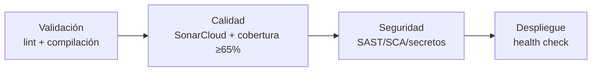

# Calidad de software - Sprint 1

## 1. Propósito y alcance

Este documento describe el plan de calidad y pruebas de Bookly Backend para el Sprint 1, el estado real de la suite de pruebas frente a HU-01 (registro de paciente) y HU-03 (inicio de sesión seguro), y lo que falta para cumplir el Quality Gate exigido por los `Lineamientos.md` antes del cierre del sprint (23/09/2026).

Los criterios de aceptación en Gherkin de cada HU viven en `HU_Reservas_Empresa_Unica.md`; este documento  los usa como base de trazabilidad hacia las pruebas automatizadas.

## 2. Requisitos de calidad exigidos para el equipo avanzado.

Según `Lineamientos.md`, secciones 3.5, 7.2 y 9.1:

| Dimensión | Criterio mínimo | Obligatoriedad |
|---|---|---|
| Análisis estático | SonarCloud con Quality Gate activo | Debe (bloquea DoD, sección 9.1) |
| Cobertura unitaria | ≥ 65% | Debe (resuelve contradicciones de umbral, sección 1.2.4) |
| Deuda técnica | Remediación máx. 2 días | Debe |
| Complejidad ciclomática | < 50 (evaluar también cognitiva) | Debe |
| Vulnerabilidades | Cero críticas | Debe |
| Historias de usuario | Criterios de aceptación en Gherkin | Debe |
| Pipeline (etapa Calidad) | SonarCloud, cobertura ≥65% | Debe (sección 7.2) |

## 3. Plan de calidad por sprint (Lineamientos 3.7)

| Sprint | Entregable exigido | Estado en `backendcf` |
|---|---|---|
| 1 | Plan de calidad y pruebas; Gherkin para HU prioritarias | Gherkin completo en `HU_Reservas_Empresa_Unica.md` (21 HU). Este documento cubre el plan de pruebas. Pendiente cerrar la brecha de la sección 6. |
| 2 | Registro de defectos; SonarCloud activo; cobertura medida; pruebas con patrón AAA | Pipeline y JaCoCo agregados (sección 7); SonarCloud bloqueado por conflicto Automatic Analysis / CI (ver sección 7.3); cobertura local ya mide 65.85% de línea (sección 5), pero SonarCloud no puede confirmarla hasta que se resuelva el bloqueo |
| 3 | Automatización de criterios de aceptación; ejecución E2E | No iniciado — depende de que Sprint 1 y 2 cierren cobertura unitaria primero |

## 4. Trazabilidad HU → Gherkin → prueba automatizada

### HU-01 — Registro de cliente/paciente

| Escenario Gherkin | Prueba automatizada | Estado |
|---|---|---|
| Registro exitoso con datos válidos | `RegisterPatientServiceTest.registroExitosoCreaLaCuentaConRolPacienteYPasswordHasheado` | Cubierto |
| Intento de registro con correo ya usado | `RegisterPatientServiceTest.registroConCorreoYaRegistradoRechazaLaSolicitud` | Cubierto |
| Intento de registro con contraseña débil | `RegisterPatientServiceTest.registroConContrasenaDebilEsRechazadoPorLaValidacionDelContrato` (valida el contrato `@Pattern` de `RegisterPatientRequest` directamente) | Cubierto |

HU-01 ya tiene sus tres escenarios cubiertos por `RegisterPatientServiceTest`.

### HU-03 — Inicio de sesión seguro

| Escenario Gherkin | Prueba automatizada | Estado |
|---|---|---|
| Inicio de sesión exitoso | `LoginServiceTest.loginExitosoEntregaTokenYReiniciaContador` |  Cubierto |
| Credenciales incorrectas en el login | `LoginServiceTest.credencialesIncorrectasDevuelvenErrorYRegistranIntento` |  Cubierto |
| Bloqueo de cuenta tras intentos fallidos repetidos | `LoginServiceTest.quintoIntentoFallidoBloqueaLaCuenta` |  Cubierto |

HU-03 es la única historia con los tres escenarios de su propio Gherkin cubiertos por prueba unitaria.

### HU-20 — Configuración inicial de la plataforma

| Escenario Gherkin | Prueba automatizada | Estado |
|---|---|---|
| Aprovisionamiento exitoso | `PlatformSetupServiceTest.aprovisionamientoExitosoCreaPlataformaYAdminConRolAdmin`, `PlatformSetupControllerTest.aprovisionamientoExitosoDevuelve201ConElIdentificadorDeLaPlataforma` | Cubierto |
| Rechazo de un segundo aprovisionamiento | `PlatformSetupServiceTest.segundoAprovisionamientoEsRechazadoCuandoYaExistePlataforma`, `PlatformSetupControllerTest.segundoAprovisionamientoDevuelve409ConErrorCodePlatformAlreadyConfigured` | Cubierto |
| Rechazo por datos incompletos | `PlatformSetupRequestValidationTest.requestSinNombreDePlataformaEsRechazadoPorElContrato`, `PlatformSetupControllerTest.requestSinNombreDevuelve400ConElContratoDeErrorCompleto` | Cubierto |
| La contraseña nunca se almacena en texto plano | `PlatformSetupServiceTest.elPasswordNuncaSeAlmacenaEnTextoPlanoYNoSeExponeEnLaRespuesta` | Cubierto |

HU-20 tiene sus 4 escenarios Gherkin cubiertos entre `PlatformSetupServiceTest` (capa de servicio, Mockito), `PlatformSetupRequestValidationTest` (contrato del DTO, Bean Validation) y `PlatformSetupControllerTest` (contrato HTTP vía `@WebMvcTest`, códigos 201/409/400). Adicionalmente, `PlatformSetupServiceTest.segundoAprovisionamientoConcurrenteEsRechazadoPorElIndiceUnicoDePlataforma` cubre la condición de carrera del índice único `uk_platform_singleton` señalada en la sección 6, y `PlatformSetupRequestValidationTest` suma dos casos de control (`name` en blanco y request válido) que no están descritos literalmente en el Gherkin.

## 5. Estado real de la suite de pruebas

```text
src/test/java/com/bookly/backendcf/
├── auth/application/LoginServiceTest.java            # 3 escenarios, HU-03 completa
├── auth/application/RegisterPatientServiceTest.java  # 3 escenarios, HU-01 completa (Mockito)
├── auth/domain/model/UserAccountTest.java            # 6 pruebas de reglas de dominio
└── BackendcfApplicationTests.java                     # smoke test de contexto Spring
```

13 tests en total, todos en verde (`./mvnw test`). Cobertura local medida por JaCoCo: **135/205 líneas = 65.85%**, ya por encima del umbral de Lineamientos 3.5 — aunque todavía no se lo reporta a SonarCloud por el bloqueo de la sección 7.3.

Sin prueba directa: `JwtTokenService`, `JwtAuthenticationFilter`, `AuthController`, `GlobalExceptionHandler`.

`LoginServiceTest` simula el repositorio con un `Proxy` de reflexión hecho a mano en vez de Mockito. `RegisterPatientServiceTest` sí usa Mockito (`mockito-core`/`mockito-junit-jupiter` 5.20.0, confirmado en el classpath de test) — conviene migrar `LoginServiceTest` al mismo patrón cuando se retome.

Fuera de `main`, en los PR abiertos #3 (HU-20, configuración inicial de la plataforma) y #4 (catálogo de servicios) tampoco hay pruebas automatizadas — su verificación es 100% manual con archivos `.http` contra una base Postgres corriendo. No se cuentan para Sprint 1 mientras no se integren a `main`.

## 6. Defectos y riesgos de calidad detectados
### Halalsgos pendientes de verificación y replicacion en local
Dejamso pendiente al fomrualcion de una posible solución, a los sigueintes hallazgos.
| Riesgo | Ubicación | Impacto |
|---|---|---|
| Carrera de duplicados (check-then-act sin atomicidad) | `RegisterPatientService.register` (`existsByEmail` → `save`) | Dos registros concurrentes con el mismo correo pueden generar una excepción de integridad no mapeada al contrato de error esperado, en vez de un 409 controlado |
| JWT construido a mano | `JwtTokenService` | Arma/parsea JSON con concatenación de strings e `indexOf`/`substring`; el `escape()` solo cubre `\` y `"`. Mayor riesgo real de seguridad del código actual |
| Secreto JWT no persistente | `JwtTokenService` | Se regenera aleatorio en cada arranque si `JWT_SECRET` no está seteado — todos los tokens emitidos antes de un restart quedan inválidos |

Este mismo patrón de carrera (check-then-act) se repite además en los PR #3 y #4 (organización, especialidad, servicio) — vale la pena tratarlo como una corrección transversal, no historia por historia, cuando esas ramas se integren.

## 7. Pipeline de calidad (CI/SonarCloud)

### 7.1 Etapas del pipeline mínimo exigido



`ci.yml` implementa hoy Validación (`mvnw compile`) y la mitad de Calidad (tests + JaCoCo + intento de análisis SonarCloud). Seguridad (SAST/SCA/detección de secretos) y Despliegue todavía no existen en el workflow.

### 7.2 JaCoCo

Agregado en `pom.xml` (`jacoco-maven-plugin` 0.8.12, ejecuciones `prepare-agent` y `report` en fase `test`). Genera `target/site/jacoco/jacoco.xml`, que es el reporte que `sonar.coverage.jacoco.xmlReportPaths` le entrega a SonarCloud.

### 7.3 Bloqueo actual de SonarCloud

El job `build-test-sonar` falla en el paso "Análisis SonarCloud" con:

```
[ERROR] Not authorized or project not found. Please check the 'SONAR_TOKEN' environment variable,
the 'sonar.projectKey' and 'sonar.organization' properties, or contact the project administrator
to verify the token's permissions.
```
---

*Causa real: el proyecto en SonarCloud tiene activo **"Automatic Analysis"** (se ve como el check separado "SonarCloud Code Analysis"  en los PR), que bloquea cualquier análisis enviado desde CI con `SONAR_TOKEN`. El modo automático no ejecuta `mvnw test`, así que nunca va a reportar cobertura real aunque se escriban tests.*

### **Bloqueante externo:** 
solo puede resolverlo quien tenga rol Admin sobre el proyecto en SonarCloud — heredado automáticamente por ser Owner de la organización de GitHub (`Szapt`). Pendiente: que esa cuenta cambie el modo a "Use CI" en `https://sonarcloud.io/project/analysis_method?id=Code-Factory-Bookly_backendcf`, o le otorgue rol Admin a alguien del equipo.

`sonar.organization` (`code-factory-bookly`) y `sonar.projectKey` (`Code-Factory-Bookly_backendcf`) en `pom.xml` ya están confirmados contra la cuenta real de SonarCloud — no son la causa del error.

## 8. Pruebas pendientes para cerrar Sprint 1

Orden de prioridad, considerando que HU-01 y HU-03 son el alcance funcional comprometido del sprint:

1. ~~`RegisterPatientServiceTest`~~ — hecho (3 escenarios Gherkin de HU-01).
2. ~~`UserAccountTest`~~ — hecho (6 pruebas de reglas de dominio).
3. **`JwtTokenServiceTest`** — casos límite del parseo artesanal (payload malformado, expiración, caracteres a escapar) — es el punto de mayor riesgo real del código (sección 6). Evaluar primero si se reemplaza por una librería vetada antes de invertir esfuerzo de test (ver sección 10).
4. **`JwtAuthenticationFilterTest`** — token ausente, inválido y válido.
5. **`AuthControllerTest`** (`@WebMvcTest` o `MockMvc`) — contrato HTTP de `/register` y `/login`, incluyendo `GlobalExceptionHandler`.

Con los puntos 1 y 2 ya resueltos, la cobertura local pasó de ~0% a 65.85% (sección 5) — el Quality Gate de cobertura ya se cumpliría en cuanto SonarCloud pueda medirlo (sección 7.3). Los puntos 3-5 siguen sumando robustez pero ya no son bloqueantes para el umbral mínimo.

## 9. Ejecución local

```bash
./mvnw test
```

Reporte de cobertura generado en:

```
target/site/jacoco/jacoco.xml   # formato que consume SonarCloud
target/site/jacoco/index.html   # reporte navegable
```

Análisis local contra SonarCloud (una vez resuelto el bloqueo de la sección 7.3):

```bash
export SONAR_TOKEN=$(cat ~/.sonar_token)
./mvnw -B verify org.sonarsource.scanner.maven:sonar-maven-plugin:sonar
```

## 10. Pendientes de evolución

Para Sprint 2 (Lineamientos 3.7): resolver el bloqueo de Analysis Method, llevar la cobertura real por encima de 65%, reescribir `LoginServiceTest` con Mockito en vez del `Proxy` manual, agregar la etapa de Seguridad al pipeline (SAST/SCA/detección de secretos) y registrar defectos de forma trazable. Para Sprint 3: automatizar los criterios de aceptación Gherkin restantes (HU-04 en adelante) y sumar ejecución E2E. La migración del JWT artesanal a una librería vetada (`io.jsonwebtoken`, ya usada en `Fab2016`) debería evaluarse antes de escribir `JwtTokenServiceTest`, para no invertir esfuerzo de prueba en código que puede reemplazarse.

### revisado por Adrian Espinosa
### co-redactado con codex.
