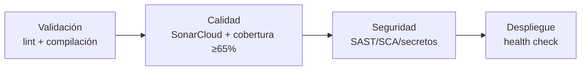

# Calidad de software - Sprint 1

## 1. Propósito y alcance

Este documento describe el plan de calidad y pruebas de Bookly Backend para el Sprint 1 (7 HU según el tablero real de Azure DevOps: HU-01, HU-02, HU-03, HU-06, HU-20, HU-21, HU-22), el estado real de la suite de pruebas, y lo que falta para cumplir el Quality Gate exigido por los `Lineamientos.md` antes del cierre del sprint (23/09/2026).

**Actualizado el 2026-09-21:** el rol `PATIENT` se renombró a `CUSTOMER` en todo el código (PR #12, migración Flyway `V4`) — este documento ya usa el nombre real. **Segunda actualización, mismo día:** se agregó `JwtTokenServiceTest` (PR #18, Quality Gate `OK`) y se corrigió en el tablero de Azure DevOps la anomalía de HU-21 (ver secciones 6, 8 y 10).

Los criterios de aceptación en Gherkin de cada HU viven en `HU_Reservas_Empresa_Unica.md`; este documento  los usa como base de trazabilidad hacia las pruebas automatizadas.

## 2. Requisitos de calidad exigidos para el equipo avanzado.

Según `Lineamientos.md`, secciones 3.5, 7.2 y 9.1:

| Dimensión | Criterio mínimo | Obligatoriedad |
|---|---|---|
| Análisis estático | SonarCloud con Quality Gate activo | Debe (bloquea DoD, sección 9.1) |
| Cobertura unitaria | ≥ 65% | Debe (resuelve contradicciones de umbral, sección 1.2.4) |
| Deuda técnica | Remediación máx. 2 días | Debe |
| Complejidad ciclomática | < 50 (evaluar también cognitiva) | Debe |
| Vulnerabilidades | Cero críticas | Debe |
| Historias de usuario | Criterios de aceptación en Gherkin | Debe |
| Pipeline (etapa Calidad) | SonarCloud, cobertura ≥65% | Debe (sección 7.2) |

## 3. Plan de calidad por sprint (Lineamientos 3.7)

| Sprint | Entregable exigido | Estado en `backendcf` |
|---|---|---|
| 1 | Plan de calidad y pruebas; Gherkin para HU prioritarias | Gherkin completo en `HU_Reservas_Empresa_Unica.md` (22 HU, sincronizado contra el tablero real). Este documento cubre el plan de pruebas. |
| 2 | Registro de defectos; SonarCloud activo; cobertura medida; pruebas con patrón AAA | Pipeline y JaCoCo agregados (sección 7); **bloqueo de SonarCloud ya resuelto** (ver sección 7.3) — el análisis corre real en cada PR/push. Quality Gate del proyecto (`branch=main`) en **`OK`**, 92.6% de cobertura de código nuevo (vs 80% que exige el gate por defecto de SonarCloud, más estricto que el 65% de `Lineamientos.md` sobre el proyecto completo) |
| 3 | Automatización de criterios de aceptación; ejecución E2E | No iniciado — depende de que Sprint 1 y 2 cierren cobertura unitaria primero |

## 4. Trazabilidad HU → Gherkin → prueba automatizada

### HU-01 — Registro de cliente

| Escenario Gherkin | Prueba automatizada | Estado |
|---|---|---|
| Registro exitoso con datos válidos | `RegisterCustomerServiceTest.registroExitosoCreaLaCuentaConRolClienteYPasswordHasheado` | Cubierto |
| Intento de registro con correo ya usado | `RegisterCustomerServiceTest.registroConCorreoYaRegistradoRechazaLaSolicitud` | Cubierto |
| Intento de registro con contraseña débil | `RegisterCustomerServiceTest.registroConContrasenaDebilEsRechazadoPorLaValidacionDelContrato` (valida el contrato `@Pattern` de `RegisterCustomerRequest` directamente) | Cubierto |

### HU-03 — Inicio de sesión seguro

| Escenario Gherkin | Prueba automatizada | Estado |
|---|---|---|
| Inicio de sesión exitoso | `LoginServiceTest.loginExitosoEntregaTokenYReiniciaContador` | Cubierto |
| Credenciales incorrectas en el login | `LoginServiceTest.credencialesIncorrectasDevuelvenErrorYRegistranIntento` | Cubierto |
| Bloqueo de cuenta tras intentos fallidos repetidos | `LoginServiceTest.quintoIntentoFallidoBloqueaLaCuenta` | Cubierto |

### HU-21 — Control de acceso a recursos ajenos

| Escenario Gherkin | Prueba automatizada | Estado |
|---|---|---|
| Dueño accede a su propio recurso | `OwnershipGuardTest.elDuenoDelRecursoPuedeAccederASuPropioRecurso` | Cubierto |
| Administrador accede a cualquier recurso | `OwnershipGuardTest.unAdministradorPuedeAccederACualquierRecurso` | Cubierto |
| Tercero sin permisos es rechazado (403 + log JSON) | `OwnershipGuardTest.unUsuarioNoPuedeAccederAlRecursoDeOtro` | Cubierto |

Mecanismo genérico (`shared/security/OwnershipGuard`), independiente de HU-08 (no existe todavía la entidad `Reserva`) — mergeado en PR #13, Quality Gate `OK`.

### HU-22 — Creación de especialistas y profesionales

| Escenario Gherkin | Prueba automatizada | Estado |
|---|---|---|
| Registro exitoso de profesional | `RegisterProfessionalServiceTest.registroExitosoCreaLaCuentaConRolProfesionalYElPerfilDeEspecialidad` | Cubierto |
| Correo ya registrado | `RegisterProfessionalServiceTest.registroConCorreoYaRegistradoRechazaLaSolicitud` | Cubierto |
| Contraseña débil | `RegisterProfessionalServiceTest.registroConContrasenaDebilEsRechazadoPorLaValidacionDelContrato` | Cubierto |

Implementada y mergeada en el PR #15. La cobertura incluye registro exitoso, correo duplicado, contraseña débil y carrera de registro simultáneo.

### HU-02 — Configuración del catálogo de servicios

| Escenario Gherkin | Prueba automatizada | Estado |
|---|---|---|
| Registro correcto de un servicio en el catálogo | `ServiceOfferingServiceTest.registroCorrectoGuardaElServicioEnElCatalogoConEstadoActivo`, `ServiceOfferingControllerTest.registroCorrectoDevuelve201ConElServicioCreado` | Cubierto |
| Intento de registrar un servicio con datos obligatorios faltantes | `ServiceOfferingRequestValidationTest.shouldRejectBlankName/shouldRejectNullName/shouldRejectBlankCategory/shouldRejectNullCategory/shouldRejectNullPrice/shouldRejectZeroPrice`, `ServiceOfferingControllerTest.registroConCamposObligatoriosFaltantesDevuelve400ConLosCamposPendientes` | Cubierto |
| Consulta pública del catálogo | `ServiceOfferingServiceTest.consultaSinFiltroDeCategoriaDevuelveTodoElCatalogo/consultaConCategoriaFiltraPorEsaCategoria/consultaConCategoriaEnBlancoSeComportaComoSinFiltro`, `ServiceOfferingControllerTest.consultaDelCatalogoDevuelve200ConLosServiciosDisponibles/consultaDelCatalogoConFiltroDeCategoriaDevuelve200ConLosServiciosDeEsaCategoria` | Cubierto |

`ServiceOfferingServiceTest` (Mockito) también cubre el rechazo por nombre duplicado (`registroConNombreYaExistenteEnElCatalogoEsRechazado`), lógica de negocio detrás de la unicidad del catálogo que no está descrita literalmente en el Gherkin. `ServiceOfferingControllerTest` (`@WebMvcTest`) suma el caso de contrato HTTP 409 `SERVICE_ALREADY_EXISTS` (`registroConNombreDuplicadoDevuelve409ConErrorCodeServiceAlreadyExists`).

**Pendiente conocido, no cubierto por diseño (ver sección 6):** `ServiceOfferingService.create` sigue con el patrón check-then-act (`existsByNameIgnoreCase` → `save()` sin atomicidad) sin corregir; no se agregó test de condición de carrera para HU-02 todavía.

### HU-06 — Configuración de duración estándar de servicios

| HU | Prueba automatizada | Estado |
|---|---|---|
| HU-02 | Ninguna sobre `ServiceOfferingService` (la lógica de duplicado por nombre) | Sin cubrir |
| HU-06 | `ServiceOfferingRequestValidationTest`, `ServiceOfferingTest` (PR #14, Miguel) | Cubierto (dominio + validación del DTO), implementado y mergeado |

### HU-20 — Configuración inicial de la plataforma

| Escenario Gherkin | Prueba automatizada | Estado |
|---|---|---|
| Aprovisionamiento exitoso | `PlatformSetupServiceTest.aprovisionamientoExitosoCreaPlataformaYAdminConRolAdmin`, `PlatformSetupControllerTest.aprovisionamientoExitosoDevuelve201ConElIdentificadorDeLaPlataforma` | Cubierto |
| Rechazo de un segundo aprovisionamiento | `PlatformSetupServiceTest.segundoAprovisionamientoEsRechazadoCuandoYaExistePlataforma`, `PlatformSetupControllerTest.segundoAprovisionamientoDevuelve409ConErrorCodePlatformAlreadyConfigured` | Cubierto |
| Rechazo por datos incompletos | `PlatformSetupRequestValidationTest.requestSinNombreDePlataformaEsRechazadoPorElContrato`, `PlatformSetupControllerTest.requestSinNombreDevuelve400ConElContratoDeErrorCompleto` | Cubierto |
| La contraseña nunca se almacena en texto plano | `PlatformSetupServiceTest.elPasswordNuncaSeAlmacenaEnTextoPlanoYNoSeExponeEnLaRespuesta` | Cubierto |

HU-20 tiene sus 4 escenarios Gherkin cubiertos entre `PlatformSetupServiceTest` (capa de servicio, Mockito), `PlatformSetupRequestValidationTest` (contrato del DTO, Bean Validation) y `PlatformSetupControllerTest` (contrato HTTP vía `@WebMvcTest`, códigos 201/409/400). Adicionalmente, `PlatformSetupServiceTest.segundoAprovisionamientoConcurrenteEsRechazadoPorElIndiceUnicoDePlataforma` cubre la condición de carrera del índice único `uk_platform_singleton` señalada en la sección 6, y `PlatformSetupRequestValidationTest` suma dos casos de control (`name` en blanco y request válido) que no están descritos literalmente en el Gherkin.

## 5. Estado real de la suite de pruebas

```text
src/test/java/com/bookly/backendcf/
├── auth/application/LoginServiceTest.java                          # 3,  HU-03
├── auth/application/RegisterCustomerServiceTest.java               # 3,  HU-01 (Mockito)
├── auth/domain/model/UserAccountTest.java                          # 6,  reglas de dominio
├── auth/security/JwtTokenServiceTest.java                          # 10, riesgo JWT (firma/expiración/estructura)
├── catalog/application/ServiceOfferingServiceTest.java             # 5,  HU-02 (servicio, Mockito)
├── catalog/domain/model/ServiceOfferingTest.java                   # 10, HU-06 (dominio/duración)
├── catalog/presentation/ServiceOfferingControllerTest.java         # 5,  HU-02 (contrato HTTP, @WebMvcTest)
├── catalog/presentation/dto/ServiceOfferingRequestValidationTest.java # 14, HU-06 (validación del DTO)
├── platform/application/PlatformSetupServiceTest.java              # 4,  HU-20 (servicio, Mockito)
├── platform/presentation/PlatformSetupControllerTest.java          # 3,  HU-20 (contrato HTTP, @WebMvcTest)
├── platform/presentation/dto/PlatformSetupRequestValidationTest.java # 3, HU-20 (validación del DTO)
├── professional/application/RegisterProfessionalServiceTest.java   # 4,  HU-22 (servicio, Mockito)
├── professional/presentation/ProfessionalControllerSecurityTest.java # 3, HU-22 (contrato HTTP/seguridad)
├── shared/security/OwnershipGuardTest.java                         # 3,  HU-21 (Mockito)
└── BackendcfApplicationTests.java                                   # 1,  smoke test de contexto Spring
```

**77 tests en `main`, todos en verde** (`./mvnw test`, verificado el 2026-09-22). Las 7 HU de Sprint 1 están mergeadas — ya no hay PR pendientes que sumar aparte.

Sin prueba directa todavía: `JwtAuthenticationFilter`, `AuthController`, `GlobalExceptionHandler` — son los únicos tres componentes de Sprint 1 sin cobertura (`PlatformSetupService`/HU-20 ya se cubrió, ver arriba).

`LoginServiceTest` simula el repositorio con un `Proxy` de reflexión hecho a mano en vez de Mockito. El resto de los tests nuevos (`RegisterCustomerServiceTest`, `OwnershipGuardTest`, `RegisterProfessionalServiceTest` del PR #15, y `JwtTokenServiceTest` del PR #18) sí usan Mockito o son de unidad plana sin mocks — conviene migrar `LoginServiceTest` al mismo patrón cuando se retome.

## 6. Defectos y riesgos de calidad detectados

| Riesgo | Ubicación | Impacto |
|---|---|---|
| Carrera de duplicados (check-then-act sin atomicidad) | `RegisterCustomerService.register`, `PlatformSetupService`, `ServiceOfferingService` (todos con `existsByEmail`/`count()` → `save()` sin atomicidad) | Dos solicitudes concurrentes pueden generar una excepción de integridad no mapeada al contrato de error esperado, en vez de un 409 controlado |
| JWT construido a mano | `JwtTokenService` | Arma/parsea JSON con concatenación de strings e `indexOf`/`substring`; el `escape()` solo cubre `\` y `"`. **Ya tiene test** (`JwtTokenServiceTest`, PR #18, 10 escenarios: firma/payload alterado, expiración, secreto distinto, estructura inválida) — el riesgo pasó de "no verificado" a "verificado y pineado por test", pero el diseño artesanal sigue siendo el mismo; migrar a una librería vetada (`io.jsonwebtoken`) sigue recomendado para Sprint 2 |
| Secreto JWT no persistente | `JwtTokenService` | El constructor ya rechaza secreto vacío o menor a 32 bytes (falla al arrancar si `JWT_SECRET` no está seteado, en vez de generar uno aleatorio) — cubierto por dos de los diez casos de `JwtTokenServiceTest` (PR #18) |

**A favor — ya corregido en un caso:** `RegisterProfessionalService` (HU-22, PR #15) **sí** resuelve bien el mismo patrón de carrera: usa `saveAndFlush` dentro de un `try/catch` de `DataIntegrityViolationException`, traducido a `EmailAlreadyRegisteredException`. Vale la pena usar ese código como referencia al corregir los otros tres servicios de la fila de arriba, en vez de reinventar el patrón cada vez.

## 7. Pipeline de calidad (CI/SonarCloud)

### 7.1 Etapas del pipeline mínimo exigido



`ci.yml` implementa hoy Validación (`mvnw compile`) y la mitad de Calidad (tests + JaCoCo + análisis real de SonarCloud, ya funcionando). Seguridad (SAST/SCA/detección de secretos) y Despliegue todavía no existen en el workflow. **Nuevo hallazgo:** `backendcf` nunca se desplegó en Render ni en ningún otro lado — dato relevante para cuando se arme la etapa de Despliegue.

### 7.2 JaCoCo

Agregado en `pom.xml` (`jacoco-maven-plugin` 0.8.12, ejecuciones `prepare-agent` y `report` en fase `test`). Genera `target/site/jacoco/jacoco.xml`, que es el reporte que `sonar.coverage.jacoco.xmlReportPaths` le entrega a SonarCloud.

### 7.3 Bloqueo de SonarCloud — RESUELTO (2026-09-17)

El bloqueo original (`Not authorized or project not found`, causado por el proyecto tener activo "Automatic Analysis" en SonarCloud en vez de "Use CI") **ya se resolvió**: alguien con rol Admin en SonarCloud cambió el modo del proyecto. Confirmado con una corrida real en `main`:

```
[INFO] ANALYSIS SUCCESSFUL, you can find the results at:
https://sonarcloud.io/dashboard?id=Code-Factory-Bookly_backendcf&branch=main
```

`sonar.organization` (`code-factory-bookly`) y `sonar.projectKey` (`Code-Factory-Bookly_backendcf`) en `pom.xml` están confirmados correctos.

**Nota sobre `continue-on-error` en el paso de Sonar:** el PR #6 (Copilot) lo agregó como parche temporal mientras el bloqueo estaba activo. Se intentó sacar (PR #11) pero se cerró sin mergear a pedido del equipo — **sigue en `ci.yml` a propósito**. Esto significa que hoy un PR puede mostrarse "verde" en GitHub aunque el Quality Gate real de SonarCloud esté en rojo — **siempre verificar el gate real** (sección siguiente), no solo el check de GitHub. Nota que solo aplica en `pull_request`; en push a `main` el paso de Sonar sí puede tumbar el job entero (pasó exactamente eso el 22/09, ver el incidente de abajo).

**Incidente del 22/09 — `SONAR_TOKEN` rechazado, ya resuelto:** entre el merge del PR #15 (00:48) y el PR #22 (05:12), las 8 corridas de CI en `main` fallaron con `HTTP 403 Forbidden. Please check ... SONAR_TOKEN` — el token había quedado inválido. `Compilar` y `Tests y cobertura` seguían pasando bien; solo el análisis de Sonar se caía. Se regeneró el token en SonarCloud y se actualizó el secreto en GitHub (17:43); se reintentó la corrida (`gh run rerun`, sin necesitar un commit nuevo) y terminó en verde.

**Estado real del Quality Gate hoy** (verificado vía API pública de SonarCloud, no solo el checkmark):

```
GET https://sonarcloud.io/api/qualitygates/project_status?projectKey=Code-Factory-Bookly_backendcf&branch=main
```

`branch=main`: **`status: OK`** — `new_coverage: 92.6%` vs `80%` exigido (el gate por defecto de SonarCloud mide cobertura de *código nuevo*, más estricto que el 65% de `Lineamientos.md` sobre el proyecto completo). Reliability, security, maintainability, duplicación y hotspots también en verde. Análisis corrido el 2026-09-22 sobre el commit `1be78fd` (el más reciente, con las 7 HU ya mergeadas).

## 8. Pruebas pendientes para cerrar Sprint 1

Actualizado con las 7 HU reales de Sprint 1:

1. ~~`RegisterCustomerServiceTest`~~ — hecho (HU-01, 3 escenarios).
2. ~~`UserAccountTest`~~ — hecho (6 pruebas de reglas de dominio).
3. ~~`OwnershipGuardTest`~~ — hecho (HU-21, 3 escenarios, mecanismo genérico independiente de HU-08).
4. ~~`RegisterProfessionalServiceTest`~~ — hecho e integrado (HU-22, 4 escenarios incluyendo la carrera de registro simultáneo).
5. ~~`ServiceOfferingTest` / `ServiceOfferingRequestValidationTest`~~ — hecho e integrado (HU-06).
6. ~~`JwtTokenServiceTest`~~ — hecho e integrado (10 escenarios: firma/payload alterado, expiración, secreto distinto, estructura inválida y validación del constructor).
7. ~~`ServiceOfferingService` (HU-02)~~ — hecho e integrado; `registroConNombreYaExistenteEnElCatalogoEsRechazado` cubre el duplicado por nombre (sección 4).
8. ~~`PlatformSetupServiceTest` (HU-20)~~ — hecho e integrado (10 tests entre servicio, controlador y validación del DTO, sección 4).
9. **`JwtAuthenticationFilterTest`**, **`AuthControllerTest`** y **`GlobalExceptionHandlerTest`** — únicos componentes de Sprint 1 sin test todavía, sin cambios.

Las 7 HU de Sprint 1 tienen cobertura automatizada completa. Lo único pendiente (punto 9) es cobertura adicional de componentes transversales que no bloquean la implementación funcional de ninguna HU.

## 9. Ejecución local

```bash
./mvnw test
```

Reporte de cobertura generado en:

```
target/site/jacoco/jacoco.xml   # formato que consume SonarCloud
target/site/jacoco/index.html   # reporte navegable
```

Análisis local contra SonarCloud (una vez resuelto el bloqueo de la sección 7.3):

```bash
export SONAR_TOKEN=$(cat ~/.sonar_token)
./mvnw -B verify org.sonarsource.scanner.maven:sonar-maven-plugin:sonar
```

## 10. Pendientes de evolución

Para continuar el cierre de Sprint 1: mantener la cobertura y corregir el patrón de carrera check-then-act en `RegisterCustomerService`/`PlatformSetupService`/`ServiceOfferingService` (usando como referencia la corrección ya aplicada en `RegisterProfessionalService`). HU-06, HU-22 y la cobertura de `JwtTokenService` ya están integradas.

**Resuelto el 2026-09-21:** la anomalía de HU-21 en el tablero de Azure DevOps (work item 32) — estaba sin Sprint asignado pese a estar mergeada desde el PR #13. Ya se movió a `Sprint 1` vía API. El `State` se dejó en `Active` a propósito (no se cerró unilateralmente el work item de David; falta que él lo pase a `Closed`).

Para Sprint 2 (Lineamientos 3.7): llevar la cobertura real por encima del 80% de código nuevo que exige el gate por defecto de SonarCloud, reescribir `LoginServiceTest` con Mockito en vez del `Proxy` manual, agregar la etapa de Seguridad al pipeline (SAST/SCA/detección de secretos), armar la etapa de Despliegue (hoy `backendcf` no está desplegado en ningún lado), y registrar defectos de forma trazable en Azure DevOps (el tipo de work item `Bug` ya está disponible, todavía no se usó ninguno).

Para Sprint 3: automatizar los criterios de aceptación Gherkin restantes y sumar ejecución E2E. La migración del JWT artesanal a una librería vetada (`io.jsonwebtoken`, ya usada en `Fab2016`) sigue recomendada, pero ya no es bloqueante para tener cobertura — `JwtTokenServiceTest` (PR #18) fija el comportamiento actual, así que la migración puede evaluarse con red de seguridad en vez de a ciegas.

**Documentos formales que faltan** (según Clases 6 y 7 del curso, distintos entre sí): un **SQAP** consolidado (IEEE 730, 7 secciones) y un **Plan de Pruebas** formal (IEEE 829/ISO 29119: alcance In/Out-of-Scope, criterios de entrada/salida/suspensión/reanudación, matriz de riesgos) — ninguno de los dos existe todavía para `backendcf`.

### revisado por Adrian Espinosa
### co-redactado con codex.
